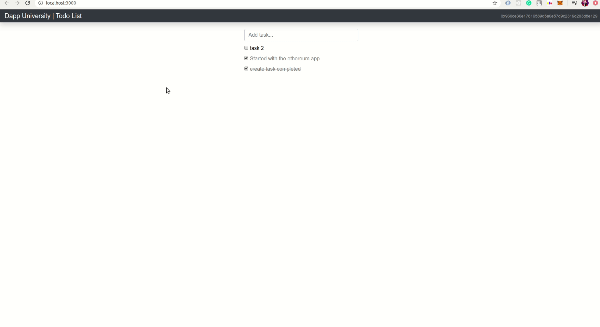

# Ethereum - TodoList
A short snippet of the working of the project   

### Setting Up the Project ###
- Clone the repository using command `git clone https://github.com/pranaykgupta/eth-todoList.git`
- `cd eth-todoList`
- Install dependensies using 
`npm install`
- Start the local blockchain may be by using [Ganache](https://www.trufflesuite.com/ganache ) and connect your browser to it using [metamask](https://chrome.google.com/webstore/detail/metamask/nkbihfbeogaeaoehlefnkodbefgpgknn?hl=en "Add its extension in chrome")
- Compile the smart contract by writing `truffle compile`
- Run the migration running `truffle migrate`
- Start the web client using command `npm run dev`
#### To run test  ####
Run `truffle test` on command line
